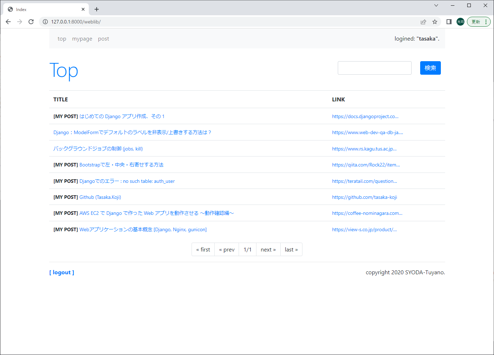

# sharing-site
## アプリ内容
簡単なユーザ投稿型サイトのwebアプリケーションです。まだ開発途中のため、適宜調整していきます。

<p align="center">
  
  <br>トップページ
</p>

## 実装環境
* Ubuntu 22.04.1 LTS
* Python 3.10.4
* Django 3.0.4

## 実装手順
WSLでvenvを使い環境を構築します。

1. ディレクトリの作成・移動
```
$ mkdir <ディレクトリ名>
$ cd <ディレクトリ名>
```

2. 仮想環境の作成
```
$ python -m venv <仮想環境名>
```

3. 仮想環境の有効化
```
$ source <仮想環境名>/bin/activate
```

4. Django のインストール
```
$ pip install django==3.0.4
```

5. パッケージのインストール
```
$ pip install django-boost
```

6. 本パッケージをクローン
```
$ git clone https://github.com/tasaka-koji/sharing-site.git
```

7. データベースを作成
```
python manage.py makemigrations
python manage.py migrate
```

8. 管理者の作成。ユーザ名とパスワードは後ほど使うので忘れないようにしてください。
```
python manage.py createsuperuser
```

9. サーバの起動
```
python manage.py runserver
```

9b. ブラウザ上で管理者画面にログイン(上記のユーザ名とパスワードを入力)  
※利用するユーザが1人の場合は9bと9cの作業の必要性はありません。
```
http://127.0.0.1:8000/admin
```

9c. 以下のサイトを参考にユーザ登録  
https://create-it-myself.com/know-how/register-as-user-on-the-django-admin-site/  
※「保存」ボタンを押すと詳細設定が開きます。「Permissions」の「Staff status」にチェックをしないと、保存したユーザでログインできません。

10. サイトを開く (サーバ起動したまま)
```
http://127.0.0.1:8000/weblib
```
